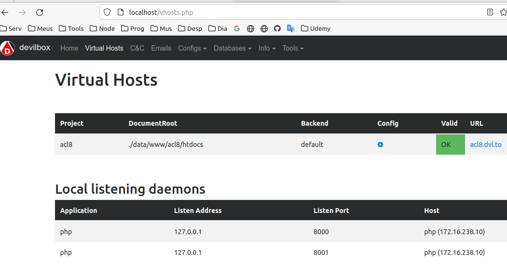

# Criando  containers com facilidade.
O Devilbox é um moderno LAMP ou MEAN dokenizado para desenvolvimento local em Linux, MacOS e Windows.

Ele facilita muito a criação de containers comparando com o uso direto do docker. Assim podemos ter em nosso ambiente de desenvolvimento ambientes isolados com versões diferentes. Geralmente tenho dificuldade de ter duas versões do PHP para testar algo com PHP 7.4 e PHP, por exemplo. Com o devilbox isso fica seguro. Segue o roteiro que usar para criar um coonteiner usando PHP 7.4, apache 2.4 e mariadb 10 (meu desktop tem php 8.1).

Ele permite que você tenha um número ilimitado de projetos prontos sem a necessidade de instalar nenhum software externo e sem a necessidade de configurar nenhum host virtual. Além de fornecer uma pilha de desenvolvimento muito flexível que você pode executar offline. (A Internet só é necessária para puxar inicialmente o contêiner docker).

A única coisa que você terá que fazer é criar um novo diretório no sistema de arquivos e seu host virtual estará pronto para ser servido com seu domínio personalizado.

Caso tenha os serviços rodando em seu desktop pare todos eles anes de executar.

## Recomendação

Parar os serviços locais, antes de instalar

## Instalar

git clone https://github.com/cytopia/devilbox

cd devilbox

Copiar o .env

cp env-example .env

Caso queira montar o cache

MOUNT_OPTIONS=,cached

## Customizar

nano .env

Comente o que não deseja e descomente o que deseja

No meu caso descomentei

7.4
apache2.4

E comentei o que estava ativo

## Criar o container e instalar os pacotes selecionados no .env

docker-compose up

En segundo pano

docker-compose up -d

## Iniciar somente alguns serviços

docker-compose up httpd php mysql

docker-compose up -d httpd php mysql

## Acessar a interface web

http://localhost

Esta página mostra todos os projetos em execução

Veja que temoos o phpmyadmin para gerenciar o mysql. phppgadmin e phpredmin

phpmemcachedadmin

## Shell

O devilbox também pode ser administrado pelo terminal

cd devilbox

./shell.sh

## Acessar a pasta do projeto

cd devilbox/data/www

mkdir projeto1

mkdir htdocs

## Criar entrada no /etc/hosts

sudo nano /etc/hosts

127.0.0.1 projeto1.loc

## Agora podemos acessar os projetos pela web assiim:

http://projeto1.loc

## Verificar a versão do php em que o devilbox está

cd devilbox

./shell.sh

php -v

## Executando comandos do laravel

Para executar comandos laravel use o shell do devilbox

cd devilbox

./shell.sh

ls

Ele listará todos os projetos criados.

Copiei a pasta de um aplicativo laravel (acl8) para

devilbox/data/www/acl8

Dentro desta pasta peciso criar a pasta htdocs

Depois preciso selecionar todo o coontreúdo de acl8, exceto htdocs e colei tudo dentro de acl8/htdocs

Executo composer install

Estando em acl8/htdocs,, executo:

composer install

## Criar o banco no mysql

Agora vou criar o banco (lembrar a senha que atribui ao mysql durante a configuração do devilbox, no meu caso, root)

Para o MySQL precisamos usar o host 172.16.238.12

mysql -h 172.16.238.12 -uroot -proot

## Customizar o AppServiceProvider

Antes de executar o comando

Editar app/Provision/AppServiceProvider.php

Adicionei

use Illuminate\Support\Facades\Schema;

    public function boot()
    {
        Paginator::useBootstrap();
        Schema::defaultStringLength(191); // Adicionei
    }

No .env do app laravel

DB_HOST=172.16.238.12

Detalhes: https://devilbox.readthedocs.io/en/latest/intermediate/work-inside-the-php-container.html

Estando no shell

## Para assumir o shell como root

Assumir como root
sudo su -

sudo apt update
sudo apt install nmap

Executar os comandos do laravel no

shell

Dentro de

acl8/htdocs

Excelente documentação
https://devilbox.readthedocs.io/en/latest/index.html

## No outro dia executar

docker-compose up -d httpd php mysql

E continuar usando o projetocriado ou criar um novo. Caso crie um novo projeto não precisa adicionar nova entrada no /etc/hosts.

## Instalar pacotes no shell

sudo apt update

Instalar o editor nano

sudo apt install nano

## Erro

Caso tenha o apache instalado em seu desktop, precisa parar ele antes de executar o devilbox.
Após usar o devilbox, para vottar a usar o apache, precisa parar o devilbox
docker-compose stop
